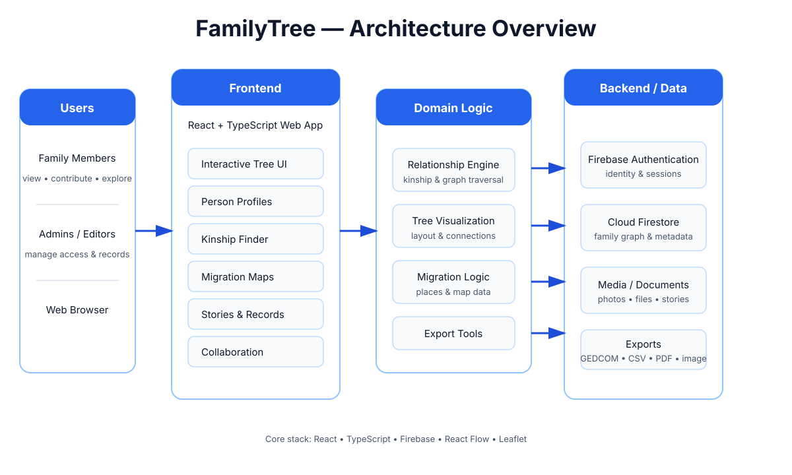
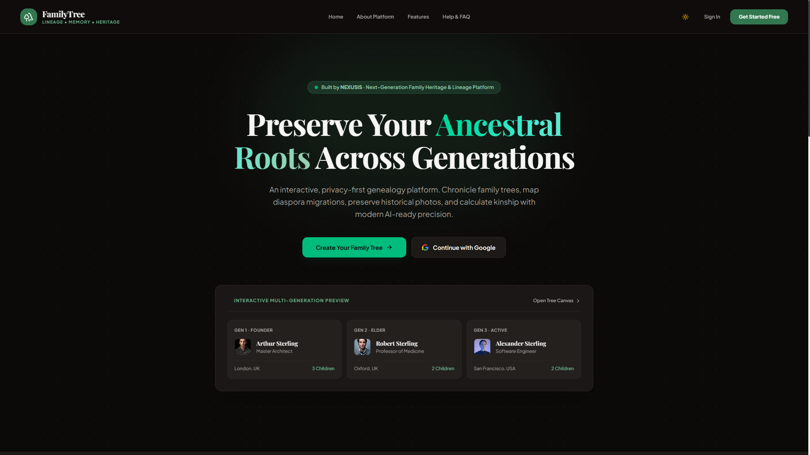
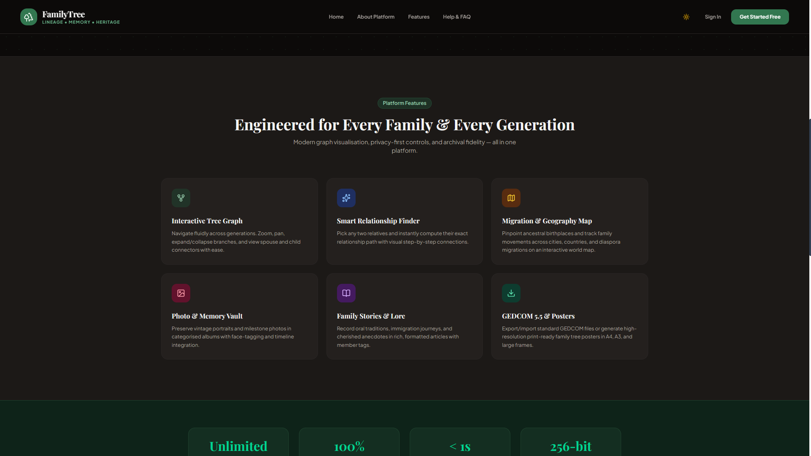
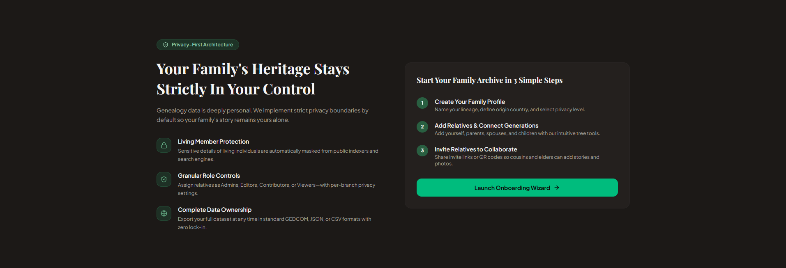
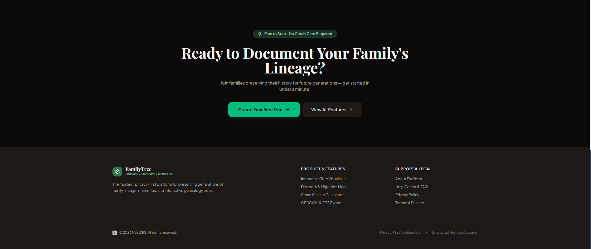

# FamilyTree

FamilyTree is a modern, privacy-focused genealogy platform and interactive workspace for chronicling lineages, calculating kinships, preserving historical stories and media archives, and collaborating with relatives across generations.

---

## 🏗️ Architecture Overview



The application separates the React/TypeScript interface from genealogy-specific domain logic and Firebase-backed identity, family data, media, collaboration, and export workflows. For a deeper technical breakdown, see [`docs/ARCHITECTURE.md`](docs/ARCHITECTURE.md).

---

## 📸 Screenshots

### 1. Hero & Interactive Multi-Generation Preview


### 2. Core Platform Features


### 3. Platform Capabilities & Metrics


### 4. Privacy-First Architecture & Onboarding


### 5. Call to Action & Navigation


---

## ✨ Features

- **Interactive Tree Visualizer**: Multi-generation family tree visualization powered by React Flow, featuring branch expansion/collapse, spouse and parent-child connectors.
- **Smart Kinship & Relationship Finder**: Instant degree-of-kinship and relationship path calculations between any two relatives.
- **Family Migration & Geography Map**: Interactive Leaflet maps pinpointing ancestral birthplaces, migrations, and diaspora travel.
- **Photo & Document Vault**: High-resolution image archives, categorization, milestone tagging, and document management.
- **Family Stories & Lore**: Rich-text story preservation for recording oral traditions, anecdotes, and immigration histories.
- **Export & Printing Workflows**: GEDCOM 5.5 import/export, CSV/JSON backups, and print-ready high-resolution PDF/image tree posters.
- **Collaborative Family Spaces**: Invite links and QR codes with role-based access (Admins, Editors, Contributors, Viewers).
- **Privacy-First Architecture**: Sensitive living-member data masking, private family partitions, and strict permission models.
- **Firebase Backend Integration**: Firebase Authentication (Email/Password & Google Sign-In) paired with Cloud Firestore security rules.

---

## 🛠️ Tech Stack

- **Framework**: [React 19](https://react.dev/) with [TypeScript](https://www.typescriptlang.org/)
- **Build Tool**: [Vite 8](https://vite.dev/)
- **Routing**: [React Router 7](https://reactrouter.com/)
- **Styling**: [Tailwind CSS v4](https://tailwindcss.com/)
- **Graph & Tree Visualizer**: [@xyflow/react](https://reactflow.dev/)
- **Mapping**: [Leaflet](https://leafletjs.com/) & [React Leaflet](https://react-leaflet.js.org/)
- **Animations**: [Framer Motion](https://www.framer.com/motion/)
- **Icons**: [Lucide React](https://lucide.dev/)
- **Backend & Auth**: [Firebase v12](https://firebase.google.com/) (Authentication & Cloud Firestore)
- **PDF & Canvas Export**: [jsPDF](https://github.com/parallax/jsPDF) & [html2canvas](https://html2canvas.hertzen.com/)
- **Linter**: [Oxlint](https://oxc.rs/)

---

## 🚀 Getting Started

### Prerequisites

- [Node.js](https://nodejs.org/) (version 20 or newer recommended)
- [npm](https://www.npmjs.com/) (version 10 or newer)
- A Firebase project with Authentication and Cloud Firestore enabled (optional for seeded demo mode)

### Installation

1. Clone the repository:
   ```bash
   git clone https://github.com/SahanPramuditha-Dev/FamilyTree.git
   cd FamilyTree
   ```

2. Install dependencies:
   ```bash
   npm install
   ```

3. Start the local development server:
   ```bash
   npm run dev
   ```

   Vite will serve the application locally (typically at `http://localhost:5173`).

### Production Build & Preview

```bash
# Type-check and build for production
npm run build

# Preview the production build locally
npm run preview
```

### Code Quality

```bash
# Run Oxlint
npm run lint
```

---

## 🔥 Firebase Configuration

Firebase is configured in [`src/services/firebase.ts`](src/services/firebase.ts). To connect your own Firebase project:

1. Create a Firebase Web App in the [Firebase Console](https://console.firebase.google.com/).
2. Enable **Authentication** (Email/Password and Google providers).
3. Create a **Cloud Firestore** database.
4. Set up security rules (refer to [`firestore.rules`](firestore.rules)) to restrict data access to authorized family members.
5. Provide your configuration keys in environment variables or update `src/services/firebase.ts`.

> [!NOTE]
> The Firebase web API key is a client-side public identifier. Security is enforced through Firebase Authentication tokens and Firestore Security Rules. Never commit private service-account keys to this repository.

---

## 🗺️ Application Routes

| Category | Route Paths |
| :--- | :--- |
| **Public** | `/`, `/about`, `/features`, `/help`, `/login`, `/register`, `/privacy-policy`, `/terms` |
| **Onboarding** | `/onboarding` |
| **Dashboard & Tree** | `/dashboard`, `/tree`, `/members`, `/relationships` |
| **Media & History** | `/timeline`, `/events`, `/photos`, `/stories`, `/documents`, `/map` |
| **Tools & Settings**| `/reports`, `/export`, `/collaboration`, `/privacy`, `/activity`, `/family-settings`, `/account` |

---

## 📁 Project Structure

```text
FamilyTree/
├── Screenshots/
│   └── landingPage/     # Application screenshots
├── assets/
│   └── architecture-overview.svg
├── docs/
│   └── ARCHITECTURE.md  # Architectural deep-dive & extension guide
├── src/
│   ├── assets/          # Static logos, icons, and hero assets
│   ├── components/      # UI components, layouts, modals, and tree node graph renderers
│   ├── context/         # AuthContext, FamilyContext, and ThemeContext providers
│   ├── data/            # Mock & initial seed family records
│   ├── pages/           # Public pages, onboarding, and authenticated workspace views
│   ├── services/        # Firebase client setup and service layer
│   ├── types/           # TypeScript interfaces and data models
│   └── utils/           # GEDCOM export/import, kinship math, and layout utilities
├── firestore.rules      # Firestore security rules
├── package.json
└── vite.config.ts
```

For more architectural details, see [`docs/ARCHITECTURE.md`](docs/ARCHITECTURE.md). Contribution guidelines are in [`CONTRIBUTING.md`](CONTRIBUTING.md).

---

## 📄 License

Copyright &copy; 2026 **Sahan Pramuditha**. All rights reserved.

This project is proprietary and confidential. No part of this software, code, assets, or documentation may be used, copied, modified, distributed, or published without the express prior written consent of the copyright owner. See the [`LICENSE`](LICENSE) file for complete details.
