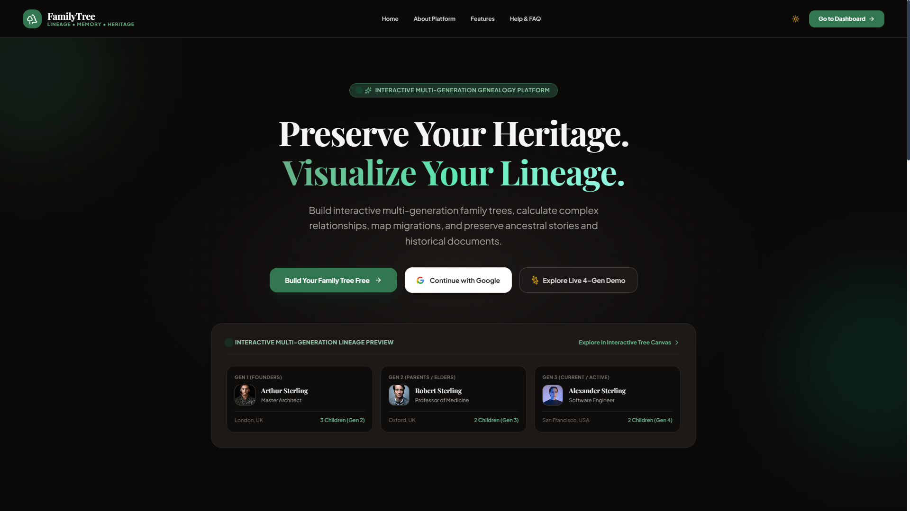
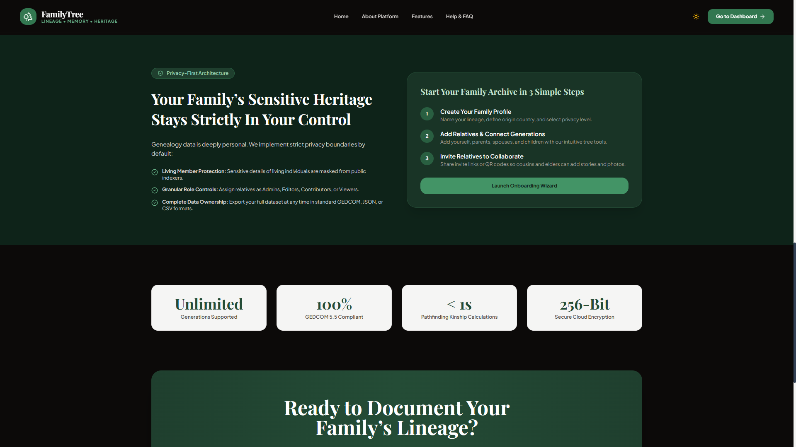

# FamilyTree

FamilyTree is a privacy-focused genealogy workspace for building interactive family trees, preserving stories and documents, and collaborating with relatives across generations.

## Screenshots





## Features

- Interactive multi-generation family tree with member profiles and branches
- Relationship finder and kinship calculations
- Family timeline, events, stories, photos, and historical documents
- Family map for recording places connected to a lineage
- GEDCOM, JSON, and CSV export workflows
- Invitations and collaboration tools for relatives
- Privacy center, activity logs, family settings, and account settings
- Firebase Authentication and Cloud Firestore integration
- Responsive public pages, onboarding flow, and authenticated dashboard

## Tech Stack

- React 19 and TypeScript
- Vite
- React Router
- Tailwind CSS
- Firebase Authentication and Firestore
- React Flow for the interactive tree
- Leaflet and React Leaflet for maps
- Framer Motion for UI animation
- Oxlint for linting

## Getting Started

### Prerequisites

- Node.js 20 or newer
- npm 10 or newer
- A Firebase project with Authentication and Cloud Firestore enabled

### Install and run

```bash
npm install
npm run dev
```

Vite will print the local development URL, normally `http://localhost:5173`.

### Production build

```bash
npm run build
npm run preview
```

### Lint

```bash
npm run lint
```

## Firebase Configuration

Firebase is initialized in [`src/services/firebase.ts`](src/services/firebase.ts). For a deployment, create a Firebase web app and configure:

1. Email/password and Google sign-in providers in Firebase Authentication.
2. Cloud Firestore in the required region.
3. Firestore security rules that restrict family data to authorized members.
4. Authorized domains for local development and the deployed site.

The Firebase web API key is an identifier, not a secret. Access control must be enforced with Authentication and Firestore Security Rules. Do not place service-account credentials in this frontend project.

## Application Routes

Public routes include `/`, `/about`, `/features`, `/help`, `/login`, `/register`, and legal pages. Authenticated routes include `/dashboard`, `/tree`, `/members`, `/relationships`, `/timeline`, `/events`, `/photos`, `/stories`, `/documents`, `/map`, `/reports`, `/export`, `/collaboration`, `/privacy`, `/activity`, and settings pages.

## Project Structure

```text
src/
  components/   Reusable UI, layouts, modals, and tree nodes
  context/      Authentication, family data, and theme state
  data/         Seed family data used by the application
  pages/        Public, auth, dashboard, and feature pages
  services/     Firebase integration
  types/        Shared TypeScript types
  utils/        GEDCOM, relationship, and tree-layout helpers
```

See [`docs/ARCHITECTURE.md`](docs/ARCHITECTURE.md) for data-flow and extension guidance. Contribution conventions are in [`CONTRIBUTING.md`](CONTRIBUTING.md).

## License

No license has been selected for this repository yet. Treat the source as all rights reserved until a license is added by the project owner.
